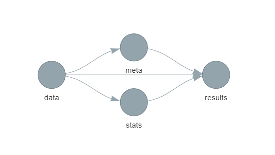
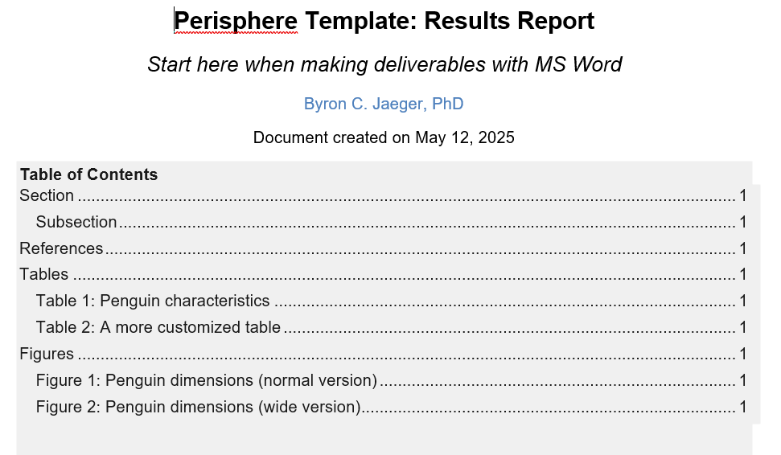
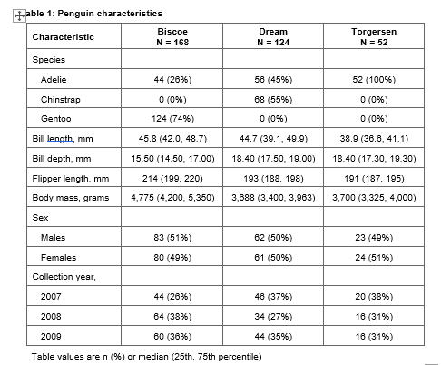

<!-- README.md is generated from README.Rmd. Please edit that file -->

# perisphere-github-exercises

This repository is used to provide hands-on exercises designed to build
familiarity with git and GitHub. It also uses `pericircle` and is based
on `pericircumference`, so it also helps to build familiarity with those
tools.

## Preliminary exercises

1.  Clone this repository (i.e., repo) to a new local project (hint:
    `usethis::create_from_github()`)

2.  Make sure all the packages in `packages.R` and in `doc/results.Rmd`
    are installed.

3.  Run `targets::tar_glimpse()` in the R console to view the targets
    pipeline in this project. You should see this flowchart:

1.  Run `targets::tar_make()` in the R console. If the pipeline runs
    successfully, it will produce an output file:
    `doc/results-v1/results-perisphere-github-exercises-v1-0.docx`. Open
    this file and verify that you see a table of contents at the top
    that looks like this:

Scroll to table 1 and verify you see output like this:

You’ve successfully cloned this project and reproduced the results it
creates! Now you’ll add your own changes and submit a pull request

## git exercises

1.  Switch to your terminal in Rstudio (or whatever interface you use
    for git) and run `git status`
