<!-- README.md is generated from README.Rmd. Please edit that file -->

# perisphere-github-exercises

This repository is used to provide hands-on exercises designed to build
familiarity with git and GitHub. It also uses `pericircle` and is based
on `pericircumference`, so it also helps to build familiarity with those
tools.

## Preliminary exercises

1.  Clone this repository (i.e., repo) to a new local project (hint:
    `usethis::create_from_github()`)

2.  Make sure all the packages in `packages.R` and in `doc/results.Rmd`
    are installed.

3.  Run `targets::tar_glimpse()` in the R console to view the targets
    pipeline in this project. You should see this flowchart:

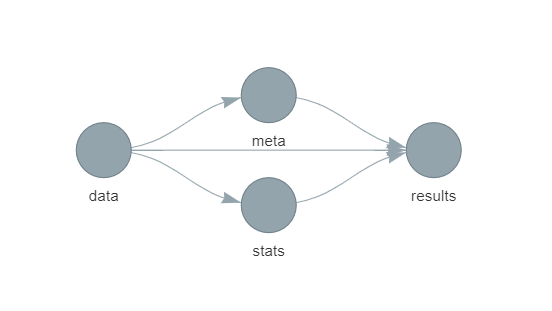

1.  Run `targets::tar_make()` in the R console. If the pipeline runs
    successfully, it will produce an output file:
    `doc/results-v1/results-perisphere-github-exercises-v1-0.docx`. Open
    this file and verify that you see a table of contents at the top
    that looks like this:

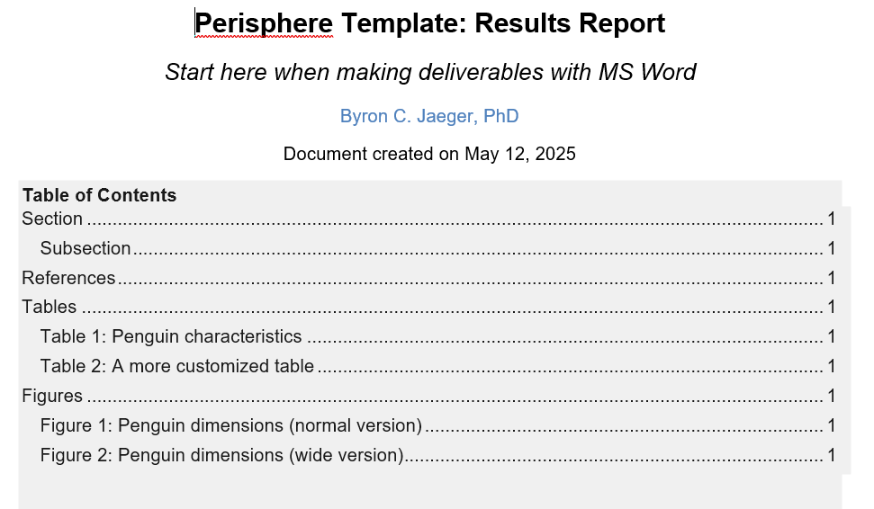

Scroll to table 1 and verify you see output like this:

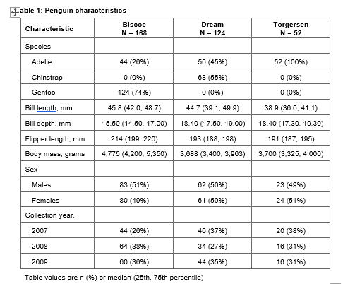

You’ve successfully cloned this project and reproduced the results it
creates! Now you’ll add your own changes and submit a pull request

## git exercise 1: create a new branch

Switch to your terminal in Rstudio (or whatever interface you use for
git) and run `git status` - you should see

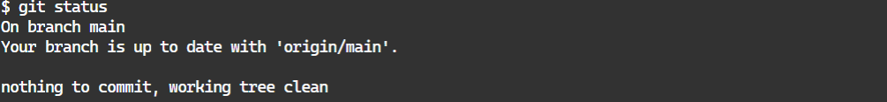

If you made any changes to non-ignored files in the repository (such as
this readme file), you may see red text like this:

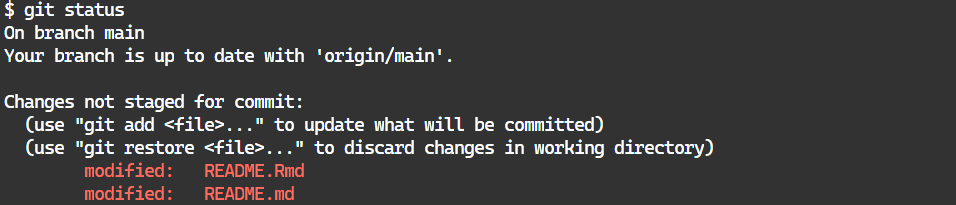

If you do see something like this, it means you modified a file. To
revert your modifications (if you see any), run `git reset --hard` in
your terminal, then verify you have a clean working branch by running
`git status` in your terminal.

Create a new branch in the project and name it with your initials or
github username (e.g., `bcj` or `bcjaeger` for me). You can make a new
branch and switch to it using `git checkout` with the `-b` option, e.g.,
in your terminal:

    git checkout -b bcj

Note that `git` will not allow you to make a new branch if the branch
you are currently working in has untracked changes (this is why we
verified that there weren’t any untracked changes in exercise 1, and
discarded them if any were present).

## git exercise 2: (optional) learn about `pericircle`

The next few exercises deal with `pericircle`, an R package we use in
Perisphere projects to keep our code clear, consistent, and minimally
redundant. Take a moment to learn about the features of `pericircle` by
reading through its
[readme](https://github.com/perisphere-rwe/pericircle?tab=readme-ov-file#pericircle)
if you are not familiar with it already.

## git exercise 3: Initialize update to results

Open `_targets.R` and find lines 12-13 - you should see these two
objects created:

``` r
results_version_major <- 1
results_version_minor <- 0
```

Use `ctrl+f` to search through `_targets.R` and see where else
`results_version_major` and `results_version_minor` are used. What do
they do? How is `results_version_minor` different from
`results_version_major`? Open up the `README.Rmd` file and Write your
responses in the space below:

*Response:*

Now you can check to see if your answer was right by modifying the value
of `results_version_minor` to be 1, and re-running the pipeline. In your
file panel, go to `doc/results-v1/` - what do you see? Was your response
above correct?

## git exercise 4: Commit your change

In your terminal, run `git status` to see what files have changed. You
should see something like this (your branch name will be different):

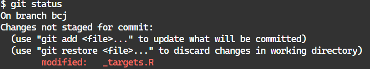

Note: You may also see the `README.Rmd` file listed here if you’ve
written your responses to exercises and saved the file. That is 100%
okay.

Why isn’t the new results document listed here? (Hint: open `.gitignore`
and check lines 51 and 52, then google “how do gitignore files work?”).
Write your response below:

*Response*:

Now you’re ready to commit these changes. First, you need to add files
to the ‘staging’ area of your commit. `git` automatically tracks which
files are new and which files have changed, but it doesn’t automatically
assume that any changed file or new file should be included in your
commit. Thus, you need to tell `git` which files should be included in
your commit using the `git add` command, e.g. run:

    git add _targets.R

and then run `git status`, you should see:

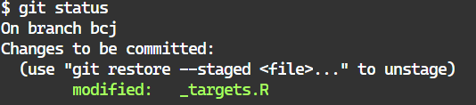

You may also add the `README.Rmd` file if you’ve modified it, but note
that `git` will throw a stop at you if you try to commit the
`README.Rmd` file without also committing the `README.md` file. To fix
this, knit the `README.Rmd` file to update the `README.md` file, then
`git add` both of them.

Once all the files you want to commit are staged (i.e., added to the
commit), you can finalize the commit using the `git commit` command. You
want to include a title for the commit message as well as a body for the
commit message. The title is a short summary that explains why you made
the commit, while the body is a longer summary of additional details.
The format for this command is

    git commit -m "title" -m "body"

For example:

    git commit -m "version 1.1 initialized" -m "I made this version update prior to changing any of my code so that when I do make changes and re-run the pipeline, version 1.0 of my results document won't be overwritten"

Notice how the message focuses on **why** I made changes instead of
focusing on what changes I made? This is because `git` meticulously
tracks the changes I made and it doesn’t need me to re-iterate them.
However, only I know **why** I made those changes, and it’s very easy to
forget **why** we programmed things a certain way, so it is very useful
to make your commits explain why you changed something, and not focus on
what you changed.

## git exercise 5: Push your branch to GitHub

For this exercise, you want to be familiar with the concept of a remote
on GitHub. I recommend [this
chapter](https://happygitwithr.com/git-remotes) of Jenny Bryan’s
excellent book: *Happy Git and GitHub for the useR* as background
reading for this exercise.

As mentioned in the book chapter, it’s likely that your local git
project already has a remote on GitHub. To check, run `git remove -v` to
list all your remotes. Here is what you want to see:

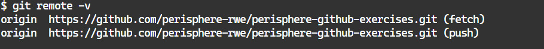

Since this remote is named `origin`, that is how we will specify that we
want to push our branch to it. However, it’s not as simple as running
`git push origin`. Why? Because we are pushing from a branch that we
created locally, and haven’t yet created on the remote. To tell `git`
that we want to push this branch to `origin` and create a new branch on
the remote in the process, we run the command

    git push origin <branch name goes here>

E.g., since my branch is called `bcj`, I run

    git push origin bcj

This creates a branch called `bcj` on the `origin` remote that matches
the local `bcj` branch I have been working on. I recommend *always*
making sure your local branch and the remote branch you create are named
the same thing. I am not sure if anything breaks if you don’t follow
this rule (I’ve honestly never tried), but I am 100% sure it could
create unnecessary confusion.

Now you might think that you can just run `git push` from now on and it
will automatically go to the branch you just created on the remote, but
we haven’t quite gotten that far. To set a default place for your branch
to push to, you need to set an “upstream” branch on the remote for your
local branch to point to. The “upstream” branch on a remote is the
default place for your local branch to push and pull code. To set the
upstream branch, we include an extra option in our push command:

    git push --set-upstream origin bcj

Or, if you prefer shortcuts,

    git push -u origin bcj

## git exercise 6: Initiate a pull request

Go to the [remote
location](https://github.com/perisphere-rwe/perisphere-github-exercises)
for this repo and click on the link to view all open branches of the
repo:

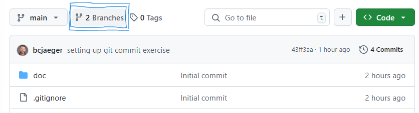

<br/>

Click on your branch:

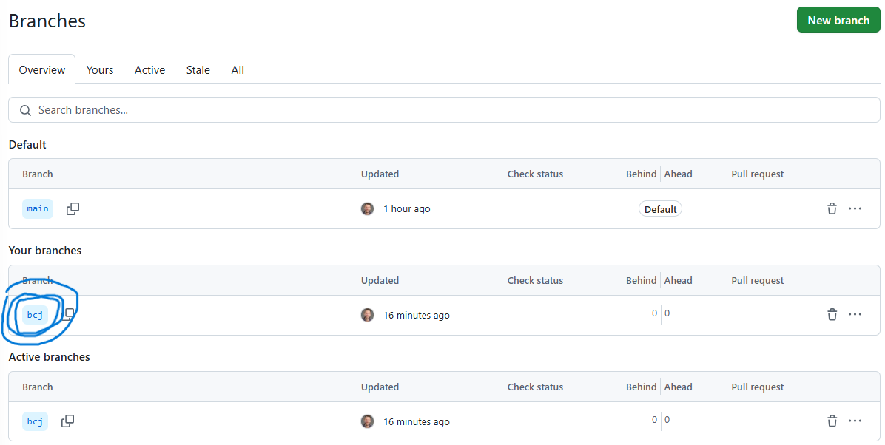

<br/>

Click on the “Compare and pull request” button (if it’s not there, you
can also click on the “contribute” button to open the pull request).

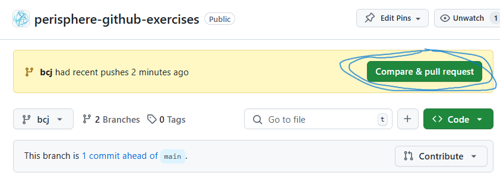

<br/>

Click on the “Create pull request” button after adding a title and
description to your pull request. Note that GitHub will use your most
recent commit message by default for this information, which is just
another incentive to write good commit messages.

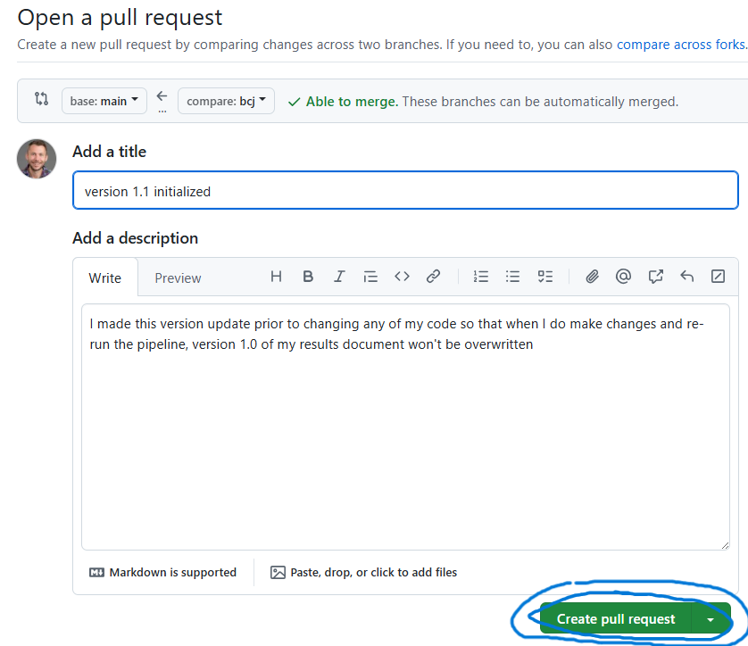

<br/>

And now you have an open pull request! :fire:

## git exercise 7: Make your contributions

Open `doc/results.Rmd` and review each block of code from start to
finish (there are a lot of useful tools introduced in the setup code
blocks). If you have any questions, [open an
issue](https://github.com/perisphere-rwe/perisphere-github-exercises/issues)
to ask for help. If everything makes sense and you feel confident you
can add a new figure or table to this document, no need to open an
issue.

Generate a new table or figure using the targets loaded inside of the
`setup-targets` code block of the `results.Rmd` file. Use Tables 1 and 2
or Figures 1 and 2 as examples to guide your work. Make sure you include
a table or figure caption to go along with your work and also provide
footnotes to clarify abbreviations or additional details if needed.

When you are happy with the results, commit your changes, push to your
upstream branch, and watch as your pull request online automatically
updates to reflect your latest commit. Then, click on the “Reviewers”
cog wheel and select me (Byron aka bcjaeger) as your reviewer.

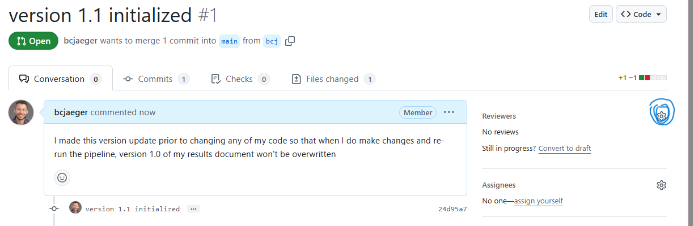

<br/>

*Note*: I will give your pull request an overly thorough review. E.g., I
will suggest changes to your code and/or request you add additional
commits to the pull request. The intent of this is not to slow you down
or frustrate you, but to give the fullest possible preview of how pull
requests can develop.
