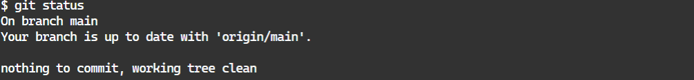

<!-- README.md is generated from README.Rmd. Please edit that file -->

# perisphere-github-exercises

This repository is used to provide hands-on exercises designed to build
familiarity with git and GitHub. It also uses `pericircle` and is based
on `pericircumference`, so it also helps to build familiarity with those
tools.

## Preliminary exercises

1.  Clone this repository (i.e., repo) to a new local project (hint:
    `usethis::create_from_github()`)

2.  Make sure all the packages in `packages.R` and in `doc/results.Rmd`
    are installed.

3.  Run `targets::tar_glimpse()` in the R console to view the targets
    pipeline in this project. You should see this flowchart:


1.  Run `targets::tar_make()` in the R console. If the pipeline runs
    successfully, it will produce an output file:
    `doc/results-v1/results-perisphere-github-exercises-v1-0.docx`. Open
    this file and verify that you see a table of contents at the top
    that looks like this:


Scroll to table 1 and verify you see output like this:


You’ve successfully cloned this project and reproduced the results it
creates! Now you’ll add your own changes and submit a pull request

## git exercise 1: create a new branch

Switch to your terminal in Rstudio (or whatever interface you use for
git) and run `git status` - you should see



If you made any changes to non-ignored files in the repository (such as
this readme file), you may see red text like this:


If you do see something like this, it means you modified a file. To
revert your modifications (if you see any), run `git reset --hard` in
your terminal, then verify you have a clean working branch by running
`git status` in your terminal.

Create a new branch in the project and name it with your initials or
github username (e.g., `bcj` or `bcjaeger` for me). You can make a new
branch and switch to it using `git checkout` with the `-b` option, e.g.,
in your terminal:

    git checkout -b bcj

Note that `git` will not allow you to make a new branch if the branch
you are currently working in has untracked changes (this is why we
verified that there weren’t any untracked changes in exercise 1, and
discarded them if any were present).

## git exercise 2: (optional) learn about `pericircle`

The next few exercises deal with `pericircle`, an R package we use in
Perisphere projects to keep our code clear, consistent, and minimally
redundant. Take a moment to learn about the features of `pericircle` by
reading through its
[readme](https://github.com/perisphere-rwe/pericircle?tab=readme-ov-file#pericircle)
if you are not familiar with it already.

## git exercise 3: Initialize update to results

Open `_targets.R` and find lines 12-13 - you should see these two
objects created:

``` r
results_version_major <- 1
results_version_minor <- 0
```

Use `ctrl+f` to search through `_targets.R` and see where else
`results_version_major` and `results_version_minor` are used. What do
they do? How is `results_version_minor` different from
`results_version_major`? Open up the `README.Rmd` file and Write your
responses in the space below:

*Response:*

Now you can check to see if your answer was right by modifying the value
of `results_version_minor` to be 1, and re-running the pipeline. In your
file panel, go to `doc/results-v1/` - what do you see? Was your response
above correct?

## git exercise 4: Commit your change

In your terminal, run `git status` to see what files have changed. You
should see
